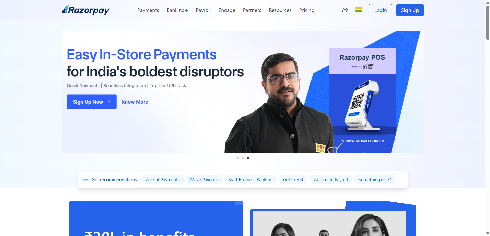

# RazorPay_Clone

This repository is a Tailwind-based front-end clone/demo of a Razorpay-style landing page. It includes a responsive navbar, an accessible stacked carousel/hero, recommendation pills, and a two-column promo hero.

## Setup

Prerequisites:
- A modern browser (Chrome, Edge, Firefox, Safari).
- Optional: a simple static server for better local testing (see examples below).

Quick start (open locally):
1. Clone or download this repository.
2. Open `index.html` in your browser by double-clicking the file.

## Frameworks & Libraries Used

- Tailwind CSS (via CDN) — utility-first CSS framework used for layout and styling.
- Font Awesome (via CDN) — for a few icons used in the demo.
- Vanilla JavaScript (`index.js`) — slider, mobile menu and accessible behavior.

No build step or bundler is required — this is a static HTML/CSS/JS demo that works directly in the browser.

## Files of Interest

- `index.html` — main page markup and Tailwind classes.
- `index.js` — accessible stacked carousel, autoplay, dots, arrows, swipe and keyboard support.
- `assets/` — images and icons referenced by the page.

## Screenshot

